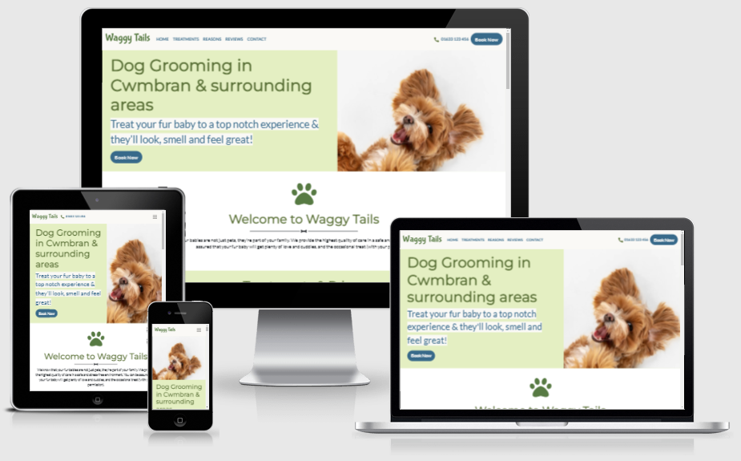

# Waggy Tails Website

[View the live site here](https://mattgriffindev.github.io/waggy-tails/ "Waggy Tails")

This is the main marketing website for Waggy Tails, a dog grooming salon based in Cwmbran. The company wants to expand its online presence by launching a website. The website should give users information about the company, the services it provides and their costs, feedback from existing customers, and ways to contact/connect with the company. Also, the website should be responsive and accessible on a range of devices, making it easy to navigate for new and existing customers.

## Contents

1. [User Experience](#user-experience-ux)
2. [Features](#features)
3. [Technologies Used](#technologies-used)
4. [Testing](#testing)
5. [Deployment](#deployment)
6. [Credits](#credits)

## 1. User Experience (UX)

### User Stories

- **As a first-time visitor, I want to...**

    1. Understand the company’s main purpose and find out more about the company’s service offer.
    2. Navigate easily within the site to find relevant content.
    3. Read customer reviews to understand what other customers think of the company and see if they are trusted.
    4. Find the company’s contact details, including social media links, and be able to contact the company easily.

- **As a returning/frequent visitor, I want to...**

    1. Find information about special offers.
    2. Find the best way to contact the company with any questions I might have.
    3. Find the social media links so that I can join and interact with other customers.

### Design

**Site Structure**

The website is a single-page website that contains only one HTML page - there are no additional pages. The website is divided into 5 main sections: (1) Welcome; (2) Treatments & Prices; (3) Reasons to Choose Us (4) Customer Reviews; and (5) Get in Touch.

This provides a more continuous, clean, and intuitive user experience - removing unnecessary clutter and focussing the user’s attention on the most important content, enabling the user to make a decision and act on it. The user navigates to different areas of the website by clicking on navigation links in the navigation menu, or by scrolling down the page to different sections of content.

**Color Scheme**

The color scheme is based on darker greens and a dark blue against white and off-white. Green is a restful color, association with nature, safety, and harmony; whereas dark blue is a confident color, associated with trust, responsibility, honesty, and loyalty. Both colors are associated with reducing stress and creating a sense of calmness. These qualities are aligned with the company's ethos and approach to customer service.

Some of these colors are darker shades than were chosen originally due to the test results from the [ally Color Contrast Accessibility Validator](https://color.a11y.com/Contrast/ "ally Color Contrast Accessibility Validator").

The revised colors were also tested for using the Eight Shapes contrast grid. The test results can be viewed [here](https://contrast-grid.eightshapes.com/?version=1.1.0&background-colors=&foreground-colors=%23000%2C%20Black%0D%0A%23386A8A%2C%20Secondary%20text%2Fbg%20color%0D%0A%235B7138%2C%20Primary%20text%20color%0D%0A%23577A43%2C%20Brand%20color%0D%0A%23e4efc2%2C%20Primary%20bg%20color%0D%0A%23FAF9F6%2C%20Tertiary%20text%2Fbg%20color%0D%0A%23fff%2C%20White%0D%0A&es-color-form__tile-size=compact&es-color-form__show-contrast=aaa&es-color-form__show-contrast=aa&es-color-form__show-contrast=aa18 "Contrast Grid")

**Typography**

The Monsterrat font is the title font used throughout the whole website. Sans-serif is the fallback font The Lato font is the paragraph font used throughout the whole website. Sans-serif is the fallback font in case the title font is not being imported correctly. The Lato font is known for its round edges and the approachable warmth it gives to the reader (see image below).

The Bubblegum Sans font is the brand fron used in the navigation bar at the top of the site and at the bottom of the site in the footer. Cursive is the fallback font. Bubblegum Sans is described as an in-your-face font; thick, round, and as playful as a puppy (see image below).

**Imagery**

The hero image is a dog posing - it was chosen to catch the user's attention and to give a fun and energetic aesthetic (see image below).

The images in the *Treatments* section were chosen to reflect the different treatents available, i.e. an image of a long-haired dog, a short-haired dog, a puppy, and a muddy dog.

**Interactive Links**

The website includes internal hyperlinks to the different sections of the site; an external hyperlink to a Google Map, which opens in a new browser tab; and external hyperlinks to Facebook, Twitter and Instagram, which open in a new browser tab.

The website includes two email address hyperlinks that will automatically open a user's email application and autofill the email address in the "To" field, the subject 'Mail from our site' in the "Subject" field, and the text 'Thank you for contacting Waggy Tails. Please let us know how we can help you...' in the body.

**Wireframes**

Wireframes for desktop, tablet and mobile view were created using [Balsamiq](https://balsamiq.com/wireframes/ "Balsamiq").

[View the wireframes here](assets/wireframes/wireframes.pdf "Wireframes")

The final website differs slightly from the wireframes as a result of developments occurring during the coding process, and from feedback from others.

## 2. Features

The website is designed to be responsive on all device sizes.

## 3. Technologies Used

**Languages Used**

- [HTML5](https://en.wikipedia.org/wiki/HTML5 "HTML5")

- [CSS3](https://en.wikipedia.org/wiki/Cascading_Style_Sheets "CSS3")

**Frameworks, Libraries and Programes Used**

- [Bootstrap v5](https://getbootstrap.com/docs/5.0/getting-started/introduction/ "Bootstrap v5") was used to assist with the responsiveness and styling of the website.

- [Google Fonts](https://fonts.google.com/ "Google Fonts") was used to import the Bubblegum Sans and Nunito fonts into the style.css file, which are used throughout the website.

- [Font Awesome](https://fontawesome.com/ "Font Awesome") was used to add icons for aesthetic and UX purposes throughout the website.

- [Hover.css](https://ianlunn.github.io/Hover/ "Hover.css") was used on the links in the navbar to add the underline-from-center transition on hover.

- [jQuery](https://jquery.com/ "jQuery") is included in Boostrap to make the navbar responsive.

- [Git](https://git-scm.com/ "Git") was used for version control by using the Gitpod terminal to commit to Git and push to GitHub.

- [GitHub](https://github.com/ "GitHub") was used to store the project code after being pushed from Git.

- [Balsamiq](https://balsamiq.com/ "Balsamiq") was used to create the wireframes during the design process.

## 4. Testing

**W3C Markup Validator**

The [W3C Markup Validator](https://validator.w3.org/ "W3C Markup Validator") was used to to validate the site's HTML. The Validator returned no errors or warnings.

A copy of the report can be accessed [here](assets/testing/w3c-html-validator.pdf "W3C Markup Validator report").

**W3C CSS Validator**

The [W3C CSS Validator](https://jigsaw.w3.org/css-validator/ "W3C CSS Validator") was used to validate the site's CSS. The Validator returned 2 errors: ‘inherit’ is not a recognised value in the border shorthand property. These errors were resolved by removing the border property as it was deemed unneccsary. The CSS validator returned a large number of warnings related to vendor extensions - these were ignored.

A copy of the original report can be accessed [here](assets/testing/w3c-css-validator-1.pdf "W3C CSS Validator report").

A copy of the final report can be accessed [here](assets/testing/w3c-css-validator-2.pdf "W3C CSS Validator report").

**Lighthouse Testing**

The website was tested using Lighthouse on the Chrome and Microsoft Edge browsers to determine the website’s performance, accessibility, best practices, and SEO.

In all tests, all measures scored at least 90%.

The reports can be viewed below:

- [Chrome Desktop](assets/testing/chrome-lighthouse-desktop.pdf "Chrome Desktop report")

- [Chrome Mobile](assets/testing/chrome-lighthouse-mobile.pdf "Chrome Mobile report")

- [Edge Desktop](assets/testing/edge-lighthouse-desktop.pdf "Edge Desktop report")

- [Edge Mobile](assets/testing/edge-lighthouse-mobile.pdf "Edge Mobile report")

**a11y Color Contrast Accessibility Validator**

The [ally Color Contrast Accessibility Validator](https://color.a11y.com/Contrast/ "ally Color Contrast Accessibility Validator") was used to test for color contrast problems. The Validator retuend 4 problems with contrast color-pairs. These problems were resolved by adjusting the contrast of the font color.

A copy of the original report can be accessed [here](assets/testing/color-contrast-accessibility-validator-1.pdf "ally Color Contrast Accessibility Validator report").

A copy of the final report can be accessed [here](assets/testing/color-contrast-accessibility-validator-2.pdf "ally Color Contrast Accessibility Validator report").

**Responsiveness Testing**

The website's responsiveness was tested manually, using the Google Chrome DevTools, and the [Responsive Design Cheker](https://responsivedesignchecker.com/ "Responsive Design Checker") website.

The website was responsive on all screen sizes from 320x480px to 1920x1200px.

### Testing User Stories

- **As a first-time visitor, I want to...**

    1. Understand the company’s main purpose and find out more about the company’s service offer.
    2. Navigate easily within the site to find relevant content.
    3. Read customer reviews to understand what other customers think of the company and see if they are trusted.
    4. Find the company’s contact details, including social media links, and be able to contact the company easily.

- **As a returning/frequent visitor, I want to...**

    1. Find information about special offers.
    2. Find the best way to contact the company with any questions I might have.
    3. Find the social media links so that I can join and interact with other customers.

- ***How this has been achieved:*** 
    
    - On entering the website, users will see a clean and readable navigation bar to navigate to each section, and a call-to-action button that links directly to the Contact section. The navigation bar is fixed to allow users to access it from anywhere on the website (see below image). 
     
    - The Hero image and text convey the company’s main message: this is a dog grooming salon covering Cwmbran and the surrounding areas with the aim of making customers’ dogs look, smell, and feel great. This is accompanied by another call-to-action button that links directly to the Contact section (see below image). 
     
    - The *Treatments & Prices* section details the different treatments available, which includes a brief description, a price list, and an accompanying image (see below image). 
     
    - The *Reasons to Choose Us* section details the various reasons to choose the company over its competitors (see below image). 
     
    - The *Reviews* section displays positive feedback from previous customers (see below image). 
     
    - The *Get in Touch* section includes a simple contact form that allows users to send a message to the company. On submission, the user receives an immediate notification that someone will contact them as soon as possible (see below image). 
     
    - The *Get in Touch* section also includes an email address hyperlink that will automatically open a user's email application and autofill the email address in the "To" field, the subject 'Mail from our site' in the "Subject" field, and the text 'Thank you for contacting Waggy Tails. Please let us know how we can help you...' in the body (see below image). 
     
    - The *Footer* provides other contact details and opening hours along with social media links to Facebook, Twitter, and Instagram, which open in a new browser tab (see below image). 
     

**Further Testing**

The website was tested manually by the developer and others to ensure that the website functioned as planned.

The following manual tests were carried out:

- The section headings and paragraph text is the correct size, font, color, and is aligned correctly, with no spelling and grammar mistakes.
- The logo in the navigation bar links to the index.html and returns the user to the top of the website.
- Navigation bar links scroll smoothly to the relevant section of the website.
- The :hover pseudo element is present and correct for all links, including buttons.
- The navigation bar is replaced by the hamburger icon at a max-width of 768px.
- The hamburger icon displays the navigation menu when pressed.
- The navigation bar is fixed to the top of website when the user scrolls down the website.
- All images are displayed correctly.
- The grid in the *Treatment* section displays as one column at a max-width of 425px and two columns thereafter.
- The grid in the *Reasons* section displays as one column to a max-width of 425px and three columns thereafter.
- The quotation icons in the *Reviews* are displayed correctly and disappear to a max-width of 425px.
- The carousel size responds to the screen size.
- The grid in the *Contact* section displays as one column to a max-width of 425px and two columns thereafter.
- The contact form fields are set to ‘required’ and returns the correct message when submitted.
- The grid in the *Footer* section displays as one column to a max-width of 425px, one column atop three columns to a max-width of 768px, and four columns thereafter.
- The social media icon links open in a new tab.
- The copyright information displays a break to a max-width of 425px.

**Known Bugs**

No bugs have been identified.

## 5. Deployment

**GitHub Pages**

The project was deployed to GitHub Pages using the following steps:

1.	Log in to GitHub and locate the [GitHub respository](https://github.com/mattgriffindev/waggy-tails/ "GitHub respository").
2.	At the top of the repository (not top of page), locate the 'Settings' icon on the menu.
3.	Scroll down the Settings page until you locate the 'GitHub Pages' Section.
4.	Under 'Source', click the dropdown called 'None' and select 'Master Branch'.
5.	The page will automatically refresh.
6.	Scroll back down through the page to locate the now published [site link](https://mattgriffindev.github.io/waggy-tails/index.html "Waggy Tails") in the "GitHub Pages" section.

**Forking the GitHub Repository**

By forking the GitHub repository you make a copy of the original repository on your GitHub account to view and/or make changes without affecting the original repository by using the following steps:

1.	Log in to GitHub and locate the [GitHub respository](https://github.com/mattgriffindev/waggy-tails/ "GitHub respository").
2.	At the top of the repository (not top of page) just above the 'Settings' icon on the menu, locate the "Fork" icon.
3.	You should now have a copy of the original repository in your GitHub account.

**Making a Local Clone**

1.	Log in to GitHub and locate the [GitHub respository](https://github.com/mattgriffindev/waggy-tails/ "GitHub respository").
2.	Under the repository name, click 'Clone or download'.
3.	To clone the repository using HTTPS, under "Clone with HTTPS", copy the link.
4.	Open Git Bash.
5.	Change the current working directory to the location where you want the cloned directory to be made.
6.	Type "git clone", and then paste the URL you copied in Step 3.
7.	Press Enter. Your local clone will be created.

## 6. Credits

**Code**

- [Bootstrap v5](https://getbootstrap.com/docs/5.0/getting-started/introduction/ "Bootstrap v5") was used to assist with the responsiveness and styling of the website.

**Information Sources/Resources**

The following sources were used to provide additional information relating to HTML and CSS:

- [W3C Schools](https://www.w3schools.com/ "W3C Schools") 

- [Stack Overflow](https://stackoverflow.com// "Stack Overflow") 

- [Saas Design](https://www.saasdesign.io/amazing-font-pairings "Saas Design") 

**Content**

All content was written by the developer with the following excpetion(s):

- The descriptions of services offered in the 'Services' section were taken from the [Pets at Home website](https://www.petsathome.com/shop/en/pets/the-groom-room/grooming-services?cm_re=groomroomHomepage-_-CTA-_-Treatments "Pets at Home").

**Media**

All images were used under the Creative Commons licence.

- [paw-solid.svg](https://fontawesome.com/v5/icons/paw?s=solid "paw-solid.svg") - used for the browser tab icon.

- [hero-img.jpg](https://www.freepik.com/free-photo/run-maltipu-little-dog-is-posing_11454003.htm "hero-img.jpg") - used for the Hero image in the Hero section.

- [bath.jpg](https://www.flickr.com/photos/wheatfields/2213648523/in/photostream/ "bath.jpg") - used in the Treatments section.

- [puppy.jpg](https://pxhere.com/en/photo/898839 "puppy.jpg") - used in the Treatments section.

- [long-hair.jpg](https://en.wikipedia.org/wiki/File:Long_Hair_GSD.jpg "long-hair.jpg") - used in the Treatments section.

- [short-hair.jpg](https://commons.wikimedia.org/wiki/File:Short_Haired_Border_Collie.jpg "short-hair.jpg") - used in the Treatments section.

All images were compressed using [TinyPNG](https://tinypng.com/ "TinyPNG").

All images were converted to .webp using [online-convert](https://www.online-convert.com/ "online-convert").

Where necessary, backgrounds were removed using [remove.bg](https://www.remove.bg/ "remove.bg").

**Acknowledgements**

Thank you to my mentor, Dario Carrasquel for his helpful feedback, and to tutor support at Code Institute for their support.
